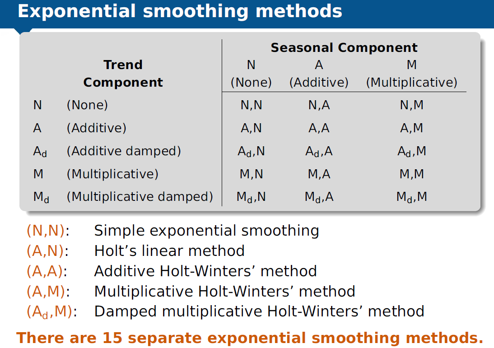
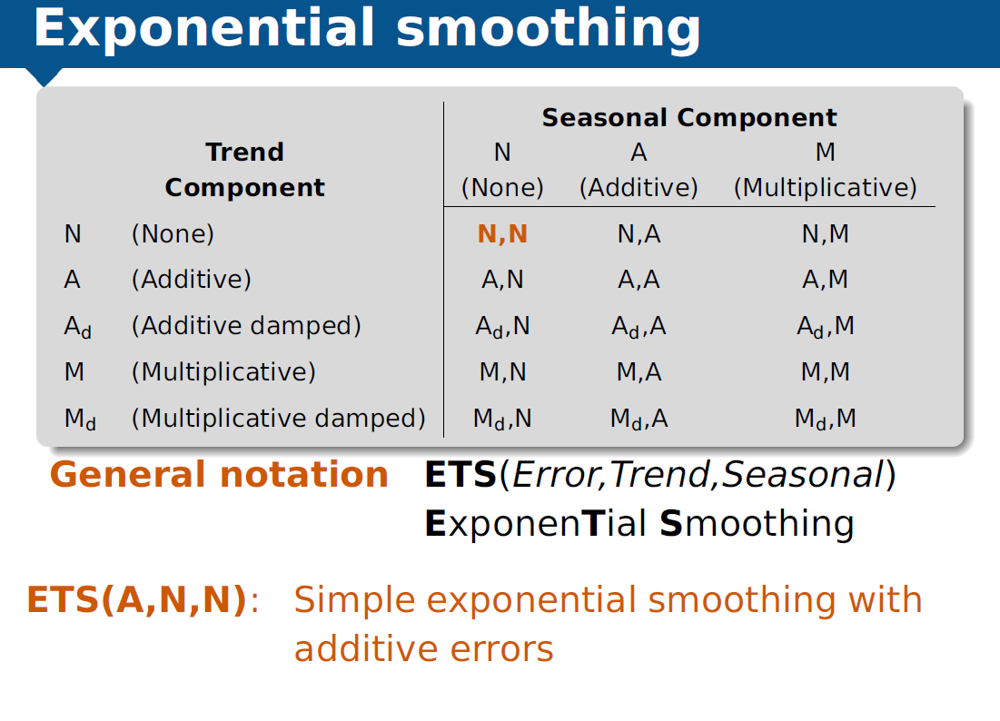
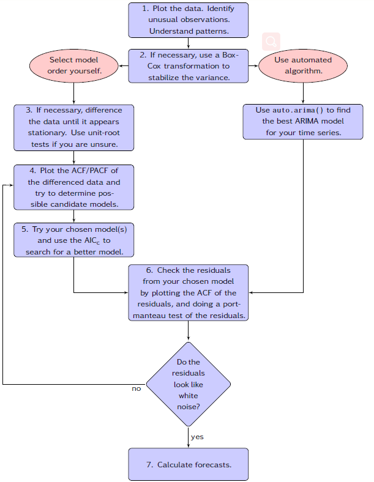
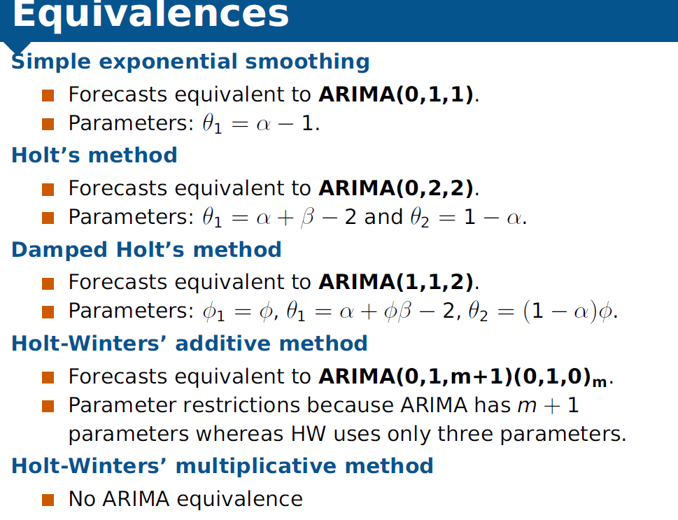

1 背景和简介  
2 算法介绍  
  2.1 传统时序预测算法  
    2.1.1 Time Serie Decomposition  
    2.1.2 Holt平滑预测方法  
    2.1.3 ARIMA预测方法  
  2.2 机器学习时序预测算法  
    2.2.1 随机森林RF模型  
    2.2.2 梯度提升数GBDT算法  
    2.2.3 梯度提升数GBDT算法  
    2.2.4 lightGBM  
  2.3 深度学习时序预测算法  
3 代码API介绍  
  3.1 数据处理  
  3.2 传统时序预测算法  
  3.3 机器学习时序预测算法  
  3.4 深度学习时序预测算法  
Reference  

## 1 背景和简介
&#8195;&#8195;参与考拉供应链需求预测项目中，我们使用了一些时序预测方法进行大盘单量和BU单量的相关时序预测。借此机会，了解到了时序预测中一些方法，包括传统时序预测方法/机器学习方法/深度学习方法。这里会进行进行学习和总结。

## 2 算法介绍
### 2.1 传统时序预测算法
#### 2.1.1 Time Serie Decomposition  
**白噪声：**  
&#8195;&#8195;时间序列中，白噪声是一种很常见的误差，白噪声的ACF中的自相关系数```r_k```近似服从```N(0, 1/T)```分布，95%的``r_k```的值在[-1.96/sqrt(T), +1.96/sqrt(T)]；否则序列可能不是白噪声序列。

**时序预测效果判断，残差诊断法：**  
&#8195;&#8195;查看残差的ACF图，时序预测结果残差一般为白噪声；否则残差中还存在有用信息，这些信息可以用来进行预测。

**时序预测分解：**  
&#8195;&#8195;通过时间序列分解，可以清楚看到时间序列的季节、趋势性成分，基于此可以使用一些简单的统计方法进行预测。(例如holt指数平滑、holt-winter方法)  

&#8195;&#8195;时间序列一般可以分解为：  
```math
Y_t = f(S_t, T_t, E_t)
```
其中Y_t是t时刻的数据值， S_t是t时刻的季节分量，T_t是t时刻的趋势分量，E_t是t时刻的残余量(无规则的值或误差)。两种常见的分解模型是加性分解和乘性分解：
```math
Additive Decomposition: Y_t = S_t + T_t + E_t  
  
Multiplicative Decomposition: Y_t = S_t * T_t * E_t  
```
加性分解模型：适用于季节性变动幅度不大时；

乘性分解模型：适用于季节性与时间成比例情况，广泛用在经济学时间序列中，取log时就会变成了加性分解模型。

#### 2.1.2 Holt平滑预测方法

**需要注意的是：一般来说，指数平滑预测适合于短期和中期的时序预测!!!**

**简单方法：**
```math
1 Random Walk Forecasts: \hat{y}(T+1|T)=y(T)  

2 Average Forecast:\hat{y}(T+1|T)=mean(y_t)

3 Simple ExponentialSmoothing:\hat{y}(T+1|T)=ay(T)+a(1-a)y(T-1)+a(1-a)^2y(T-2)+...

as: \hat{y}(t+1|t)=ay(t)+(1-a)\hat{y}(t|t-1)  

as: \hat{y}(t+h|t) = l(t), l_t=ay(t)+(1-a)l(t-1)
```

**无季节性趋势Holt方法：**  
&#8195;&#8195;考虑了时间序列的趋势，也就是相邻两个数之间的斜率(具体参考ppt第五章):  
&#8195;&#8195;Holt's local trend method  
&#8195;&#8195;Multiplicative version of Holt’s method  
&#8195;&#8195;Damped trend method  

**季节性+趋势Holt-winter方法：**  
&#8195;&#8195; Holt and Winters extended Holt’s method to
capture seasonality. (具体参考ppt第6章)


**图1 指数平滑方法各种组合**

**综合：ETS方法**   
&#8195;&#8195; 由于指数平滑方法的各种组合，导致我们无法很好的分辨出使用哪种组合进行预测，因此有人提出ETS方法。 (超过30种不同的预测方法)

**图2 ETS方法相关组合介绍**

使用ETS预测一般步骤 From Hyndman et al. (2008):  
1）尝试ETS中30种方法的每一种进行预测，一般使用最大似然估计初始化参数；  
2）通过计算AIC值，知道最好的预测方法；  
3）使用最好的预测方法产生预测值；
4）使用优先的模型获得预测区间。

#### 2.1.3 ARIMA预测方法
**自回归（AR）模型：**   
```math
y(t) = c+a_1y(t-1)+a_2y(t-2)+...+a_py(t-p)+e_t

AR(1) model: y(t) = c+a_1y(t-1)+e_t
```
&#8195;&#8195; 如果a1=1，c=0时，那么该公式等于Random Walk模型

**滑动平均（MA）模型：**   
```math
y(t) = c+e_t+b_1e(t-1)+b_2e(t-2)+...+b_qe(t-q)
```
&#8195;&#8195; 该模型是将历史的误差作为预测子来预测结果的多变量回归模型。

**自回归滑动平均（ARMA）模型：**    
```math
y(t) = c+a_1y(t-1)+a_2y(t-2)+...+a_py(t-p)

+b_1e(t-1)+b_2e(t-2)+...+b_qe(t-q)+e_t
```
&#8195;&#8195; 当ARMA模型用在差分数据中时，即为ARIMA模型。

**自回归集成滑动平均（ARIMA）模型：**    

**ARIMA(p, d, q) model**  
&#8195;&#8195;AR: p = order of the autoregressive part  
&#8195;&#8195;I: d = degree of first differencing involved  
&#8195;&#8195;MA: q = order of the moving average part.  

White noise model: ARIMA(0,0,0)  
Random walk: ARIMA(0,1,0) with no constant  
AR(p): ARIMA(p,0,0)  
MA(q): ARIMA(0,0,q)  

如何选取非季节性的参数：  
（机器计算能力可以的话，可以使用Gridsearch的方法进行搜索）  
d：d越大，预测区间增加的越快；通过unit root测试进行挑选；   
p：对于周期序列，p>2, 而且需要其他系数限制；通过最小AIC挑选；  



**图3 非季节性Arima预测流程**

**季节性的ARIMA模型：**    
（可以使用auto.arima寻参）  
ARIMA (p, d, q) (P, D, Q)m  
where m = number of periods per season 

Arima和ETS关系图：  


### 2.2 机器学习时序预测算法    
&#8195;&#8195;这里主要考虑了一些集成学习（Ensemble Learning）的相关算法。目前根据集成学习中学习器的关系分为两类：  
&#8195;&#8195;1）基本学习器之间不存在强依赖，可以并行生成的方法，bagging和随机深林；通常在强分类器和复杂模型上表现很好；  
&#8195;&#8195;2）基本学习器之间强依赖，必须串行的方法，boosting的方法；通常在弱模型上表现更好；

#### 2.2.1 随机森林RF模型
&#8195;&#8195;类似于bagging算法的思想，RF模型对bagging算法进行了升级，首先是使用CART决策树作为弱学习器，二是引入随机特征属性的选择，对于每个节点的属性集合中随机选择一个包含K个属性的子集，从该自己中选择最优属性划分。


优点：  
1）训练可以高度并行化，对于大数据时代的大样本训练速度有优势。  
2）由于可以随机选择决策树节点划分特征，这样在样本特征维度很高的时候，仍然能高效的训练模型。   
3）对部分特征缺失不敏感，训练出的模型的方差小，泛化能力强。  
缺点：  
1）在某些噪音比较大的样本集上，RF模型容易陷入过拟合。   
2）取值划分比较多的特征容易对RF的决策产生更大的影响，从而影响拟合的模型的效果。

#### 2.2.2 梯度提升数GBDT算法  
&#8195;&#8195;GBDT和以前的adaboost不同，使用限定的CART回归树作为弱学习器；其次在迭代过程中，后一轮需要找到一个决策树使得前一轮传来的样本损失误差变小，即每个新模型的简建立是为了是之前的模型的残差梯度下降。

具体算法介绍：https://www.cnblogs.com/pinard/p/6140514.html   
调参介绍：https://www.cnblogs.com/pinard/p/6143927.html

优点：  
1）可以灵活处理离散数据和连续数据；  
2）使用一些健壮的损失函数，可以使得对异常值处理也很鲁棒；  
缺点：  
1）弱学习器依赖性使得难以并行计算，可以使用SGBT来达到部分并行；

#### 2.2.3 梯度提升数GBDT算法 
&#8195;&#8195;类似于GBDT，XGB也是拟合残差，进一步减少残差，但不同的是XGB还支持使用线性分类器，同时对代价函数进行了泰勒展开，得到了一阶和二阶的导数。XGB在代价函数中加入了正则项，防止过拟合。  

具体算法介绍：https://blog.csdn.net/a819825294/article/details/51206410  
调参介绍：https://www.analyticsvidhya.com/blog/2016/03/complete-guide-parameter-tuning-xgboost-with-codes-python/

#### 2.2.4 lightGBM
&#8195;&#8195;微软推出的lightGBM类似于XGBoost的原理，在框架上做了一些优化，主要为以下几点：  
1）基于Histogram的决策树算法  
2）带深度限制的Leaf-wise的叶子生长策略  
3）直方图做差加速  
4）直接支持类别特征(Categorical Feature)  
5）Cache命中率优化  
6）基于直方图的稀疏特征优化  
7）多线程优化  


具体算法介绍：  
https://github.com/Microsoft/LightGBM/  
https://www.jianshu.com/p/48e82dbb142b 

### 2.3 深度学习时序预测算法 
可参考ppt:RNN到LSTM

## 3 代码API介绍  
### 3.1 数据处理   
data.process.py       
方法 | 作用 | 备注  
--- | --- | ---  
draw_acf_pacf() | 自相关和偏相关作图 | 查看周期，是否为WN等  
decompose() | 时序分解 | 查看趋势、周期等性质，可以分别来时序预测   

### 3.2 传统时序预测算法  
simple_predict_method.py  
方法 | 作用 | 备注  
---|---|---  
ses_method() | 简单加权指数平滑预测 | 也可以调用SimpleExpSmoothing方法  
holt_method() | 非季节性+趋势的holt预测 | \  
holt_winter_method() | 季节性+趋势性的holt-winter预测 | \  
autoarima_method() | 自动选参的arima模型 | 要下载pyramid库  
sarimax_method() | 季节性SARIMAX模型 | 可以使用GridSearch查找参数  
ETS() | \ | 无python实现，可以调用R包  

### 3.3 机器学习时序预测算法    
ml_predict_method.py  
方法 | 作用 | 备注  
---|---|---  
rf_method() | 随机森林方法 | 这里使用了默认参数  
gbdt_method() | GBDT方法 | 具体寻参等可类似于xgboost_algorithm.py  
gbm_method() | lightgbm方法 | 具体寻参等可类似于xgboost_algorithm.py  

xgboost_algorithm.py    
方法 | 作用 | 备注    
---|---|---  
xgb_model() | xgb模型的寻参和训练 | ml方法的寻参都可以使用GridSearch  
xgb_predict() | xgb模型预测 | \    

### 3.4 深度学习时序预测算法    
seq2seq_algorithm.py    
方法 | 作用 | 备注    
---|---|---  
s2s_model() | seq2seq模型的训练过程 | 使用的是attention模型，需要配置网络结构   
s2s_predict() | seq2seq模型预测 | \    

## Reference   
更多补充内容可参考 tsforecast.ppt by wangjun  

1 Forecasting using R, Rob J Hyndman  
2 https://www.analyticsvidhya.com/blog/2018/02/time-series-forecasting-methods/  
3 RNN到LSTM.ppt, Jay Hou  
4 tsforecast.ppt, Jun Wang# Time_series_forecast
